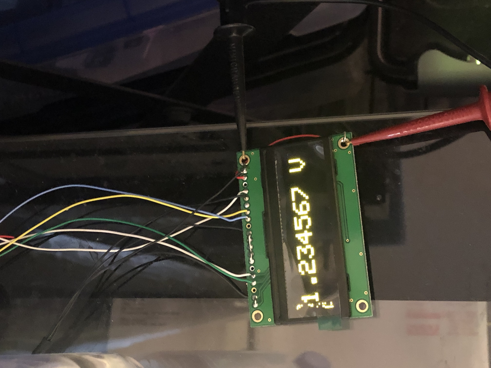

# 8Bit_Winstar_OLED

This library is a modified version of Adafruits Liquid Crystal Library for the WinStar OLED displays. Using the LiquidCrystal library I was able to write to the display, but I would regularly get garbage info on the display. Tracking down the Winstar datasheet showed a different initialization sequence than the HD44780 uses. See the Winstar datasheet included in this github repo. Now can write to the display with no issues! Enjoy!

Note: I used this display in 8 bit mode and may have deleted part of the code in the library for 4 bit usage.

The display was used to show programmed voltage coming out of AD5791 20 bit DAC. The Winstar display shows the programmed voltage, simultaneously the actual voltage is measured with Keithley 2001

  

  

